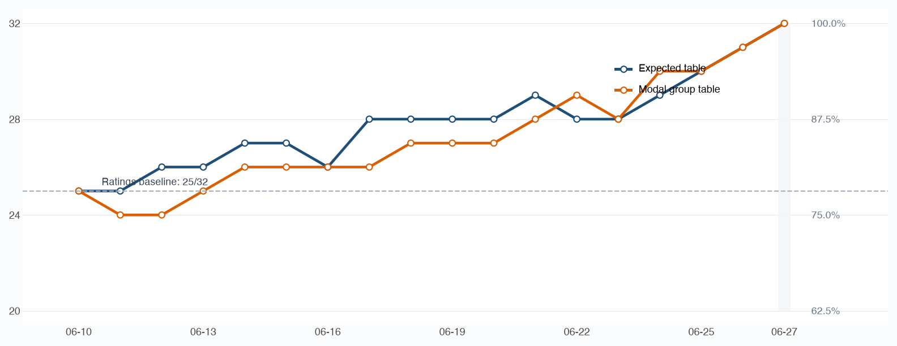
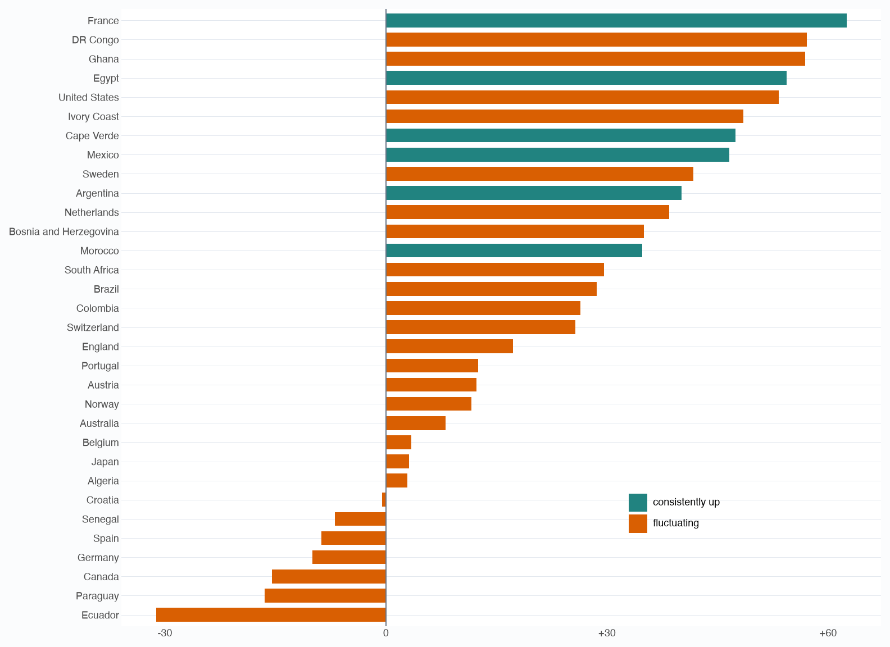
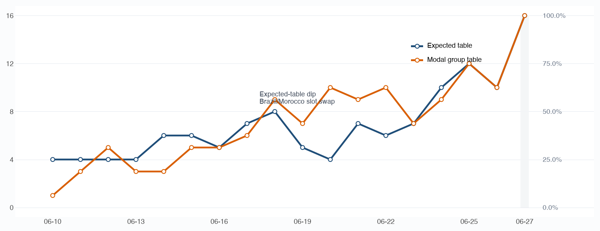
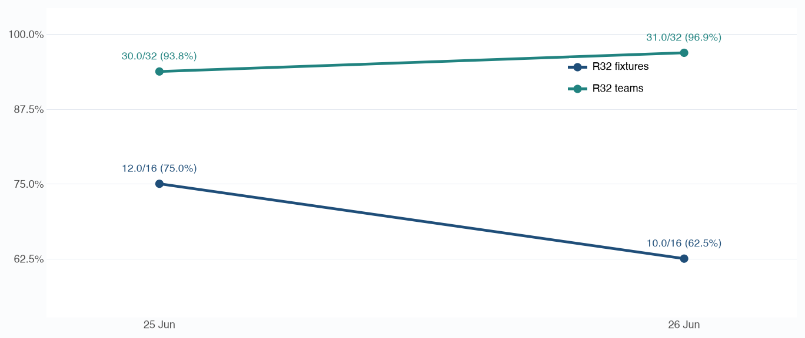
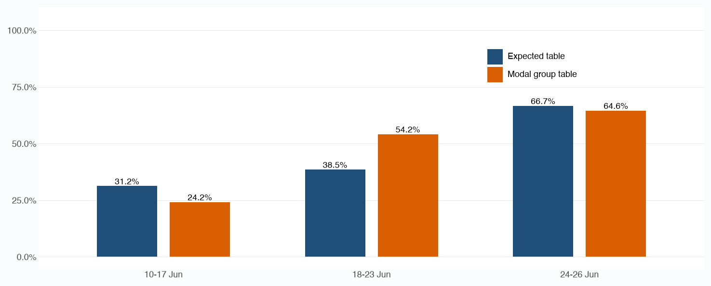

# R32 bracket convergence retro

## Executive summary

- Early team accuracy was mostly a ratings-prior result. The first snapshot picked 25/32 R32 teams, matching a simple top-32 ratings baseline.

- Fixture accuracy lagged because the bracket is a routing problem. The first snapshot had only 4/16 correct fixtures for `expected-table` and 1/16 for `modal-group-table`.

- The methods failed differently. `expected-table` was steadier early; `modal-group-table` was stronger in the middle window when exact routes mattered more.

- 2026-06-26 exposed the 48-team format risk: team accuracy rose to 31/32, but fixture accuracy fell to 10/16 because late Group G/H/I results changed the third-place assignment.

- Recommendation: report team accuracy and fixture accuracy separately, and use method disagreement as an instability signal.

## Context and methodology

This retro evaluates how daily R32 bracket projections converged to the confirmed R32 bracket, and how the model's derived team ratings moved during the group stage.

### Data and projection methods

The bracket analysis uses daily `most_likely_knockout_bracket.csv` files in `outputs/`, compared with the confirmed R32 fixtures in `data/world_cup_2026/fixtures.csv`.

Two bracket-building methods are compared. `expected-table` averages simulated group performance first, then seeds the bracket from those expected tables. `modal-group-table` instead chooses each group's most common ordered table first, then seeds the bracket from those modal tables.

The rating-change analysis uses the confirmed R32 teams only. It measures changes in each team's derived rating from the opening snapshot on 2026-06-10 to the post-group-stage snapshot.

### Bracket accuracy metrics

Let \(A\) be the confirmed R32 team set, \(P\) the predicted R32 team set, and \(S\) the set of R32 match slots. For each slot \(s\), let \(A_s\) and \(P_s\) be the unordered two-team fixtures in that slot.

\[
\begin{aligned}
\text{team accuracy} &= \frac{|A \cap P|}{|A|} \\
\text{placement accuracy} &= \frac{\sum_{s \in S} |A_s \cap P_s|}{2|S|} \\
\text{fixture accuracy} &= \frac{|\{s \in S : A_s = P_s\}|}{|S|}
\end{aligned}
\]

Team accuracy answers who made the R32. Fixture accuracy answers who played whom. Placement accuracy sits between them: it gives half-credit when one confirmed team is in the right slot.

### Rating movement metrics

For each confirmed R32 team, let \(r_t\) be the derived rating at daily snapshot \(t\), from \(t = 0\) on 2026-06-10 to the post-group-stage snapshot \(T\). Let \(\Delta_t = r_t - r_{t-1}\) for each daily rating update. Let \(U\) be the number of updates where \(\Delta_t > 0\), and \(D\) the number of updates where \(\Delta_t < 0\).

\[
\begin{aligned}
\text{net rating change} &= r_T - r_0 \\
\text{gross rating movement} &= \sum_{t=1}^{T} |\Delta_t| \\
\text{directional efficiency} &= \frac{r_T - r_0}{\sum_{t=1}^{T} |\Delta_t|} \\
\text{directional balance} &= \frac{U - D}{U + D}
\end{aligned}
\]

Net rating change measures final impact. Gross rating movement measures volatility. Directional efficiency shows how much movement resolved into the final rating change, while directional balance shows whether the updates mostly pointed up or down.

## Deep dive analysis

### Finding 1: Early team accuracy was prior-driven

The first snapshot already picked 25/32 R32 teams. That looks strong, but the baseline check changes the interpretation: a simple top-32 cut from the 2026-06-10 ratings also picked 25/32. The model did not learn most of the R32 field from early group results; it started with a strong prior.

The errors were concentrated near the qualification cut line: teams strong enough to be plausible R32 candidates, but not strong enough to be near-locks. The ratings baseline missed Bosnia and Herzegovina, Cape Verde, DR Congo, Egypt, Ghana, South Africa, Sweden and included Iran, Panama, Scotland, South Korea, Turkey, Uruguay, Uzbekistan instead. This is the main implication: early team accuracy says the ratings prior was good, not that the bracket was already reliable.

### Finding 1b: Group-stage ratings still reshaped the field

France were the cleanest strong performer. They had the largest net gain (`+62.5`), and that matched their gross movement (`62.5`), meaning none of their group-stage rating updates went backwards. Their directional efficiency and balance were both perfect (`1.00`/`1.00`). Egypt, Cape Verde, Mexico, Argentina and Morocco were also clean risers: all three of their group-stage rating updates increased their derived rating.

DR Congo (`+57.1`) and Ghana (`+56.9`) were almost as punchy on net change, but less clean: each had one negative update, leaving directional efficiency at `0.75` and `0.70` and directional balance at `0.33`. The United States were the clearest volatility case: a big net gain (`+53.3`) with the largest gross movement of any R32 team (`136.3`), but lower efficiency (`0.39`) because their path included a large rating drop as well as large gains.

At the other end, Ecuador were the clearest underperformer: `-31.2` net change from `107.4` gross movement, with negative efficiency (`-0.29`) and balance (`-0.33`). That was choppy underperformance, not a simple one-way slide. Paraguay, Canada, Germany, Spain, Senegal and Croatia also finished below their starting rating.

So the prior still explains much of the early R32 field, but the group stage meaningfully reshuffled strength inside that field. The team list was partly known early; the direction of travel was not.

### Finding 2: Fixture accuracy lagged because routes were unstable

Fixture accuracy moved later and less smoothly than team accuracy because the bracket depends on routes, not just team names. The clearest example is the 19-20 June `expected-table` dip. The model still had many of the right teams, but Brazil and Morocco crossed the C/F bracket paths, turning Netherlands v Morocco and Brazil v Japan into Netherlands v Brazil and Morocco v Japan. France v Sweden and Mexico v Ecuador also broke in the same window.

`modal-group-table` avoided that dip because it chose one internally consistent table path. In that path, Brazil/Morocco and Netherlands/Japan stayed on the correct sides of the C/F crossover, then four fixtures became correct on 20 June. This is different from `expected-table`, where averaging can put teams near rank cut-offs and make a small expected-points move change the route. We tested a weekly-cycle explanation, where fixture accuracy would jump after each broad round of group matches; the evidence is weaker than the route-threshold explanation.

### Finding 3: More correct teams can still mean fewer correct fixtures

The 26 June move is the best stress test. Both methods improved from 30/32 to 31/32 teams when Egypt replaced Belgium, but both fell from 12/16 to 10/16 fixtures. This happened on 26 June because Groups G, H, and I completed that day, after Groups A-F had already settled many of the apparent R32 routes. The bracket had enough correct fixtures to be exposed, and the new G/H/I results moved the third-place assignment across several slots.

The bigger lesson is about the 48-team World Cup format. Eight of twelve third-place teams qualify, and FIFA's R32 structure does not simply place them in one fixed slot each. They are assigned through constrained routes. Here, Australia v Belgium became the correct Australia v Egypt, but Germany v Paraguay, France v Sweden, and United States v Bosnia and Herzegovina broke when third-place teams were rerouted through slots 74, 77, and 81. This format makes exact knockout brackets harder to predict than team qualification lists.

### Finding 4: Method disagreement is the useful signal

Neither method is clearly better. `expected-table` is the better default for a public bracket view because it starts stronger and is less dependent on one simulated path. `modal-group-table` was better in the middle window, averaging 8.7/16 correct fixtures from 2026-06-18 to 2026-06-23 versus 6.2/16 for `expected-table`.

The value is in the disagreement. When the two methods diverge, the bracket is likely sensitive to group-rank thresholds or third-place routing. That is the signal analysts should watch, not only the headline accuracy of either method.

## Strategic recommendations

- Keep `expected-table` as the default bracket view.

- Keep `modal-group-table` as a comparison view and use disagreement as a warning flag.

- Report team accuracy and fixture accuracy separately in every group-stage bracket update.

- Add probability outputs for R32 teams and R32 fixtures, not just the single top bracket.

- Treat late group-stage brackets as provisional until fixture accuracy is high.

## Next steps

- Add team accuracy, placement accuracy, and fixture accuracy to future retro outputs.

- Save probability mass for R32 teams and fixtures in future runs.

- Add a daily method-disagreement summary.

- Test a slot-distance metric for bracket movement.

## Technical appendices

The reproducible analysis artefacts are generated by `scripts/retro_r32_convergence.py`:

- [Daily convergence summary](r32_convergence_summary.csv)
- [Slot-level audit](r32_convergence_slot_audit.csv)
- [Ratings baseline audit](r32_ratings_baseline.csv)
- [R32 rating change metrics](r32_rating_change_summary.csv)
